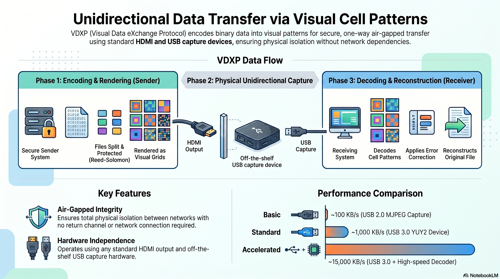

# VDXP — Visual Data eXchange Protocol

**エアギャップ環境向け HDMI 経由の単方向データ転送プロトコル**

VDXP は任意のバイナリデータを画面上の視覚的セルパターンとして符号化します。HDMI 出力と USB キャプチャデバイスを介して信号をキャプチャし、デコードして元のデータを復元します。ネットワーク接続不要。USB ドライブ不要。



## 概要

```
[送信側] → 画面にセルパターン表示 → HDMI → [USB キャプチャ] → デコード → [受信側]
```

### 仕組み

1. **送信側** がファイルをチャンクに分割し、Reed-Solomon 誤り訂正を適用、各チャンクを色（またはグレースケール）セルのグリッドとして HDMI 出力に描画
2. **キャプチャデバイス** が HDMI 信号を USB 経由でデジタル化
3. **受信側** がセル値をデコード、RS で誤り訂正、ファイルを再構成

### 主要な設計要素

- **セルグリッド符号化** — ディスプレイを均一なセルグリッドに分割。各セルは色またはグレースケールレベルとして複数ビットのデータを運ぶ。
- **カラーパレット** — 非可逆圧縮キャプチャ向けの BGR 8色（キューブ頂点）、非圧縮キャプチャ向けの Y-only グレースケール（Y16/Y32/Y64）。
- **Reed-Solomon 誤り訂正** — GF(2^8) 上のブロック単位 FEC により、キャプチャアーティファクトがあっても信頼性の高い転送を実現。
- **3段階デコードフィルタ** — フィンガープリント → ヘッダのみ → フルデコード。重複を早期に排除して CPU 負荷を最小化。
- **ループ再生** — 送信側がフレームを連続ループで表示し、受信側がすべてのユニークフレームを収集するまで継続。

## 主要特性

- **単方向** — データは一方向のみ（ディスプレイ → キャプチャ）。リターンチャネルなし。
- **エアギャップ対応** — HDMI + USB キャプチャのみで物理的に隔離されたネットワーク間を転送。
- **ハードウェア非依存** — 任意の HDMI 出力と USB キャプチャデバイスで動作。
- **完全性** — Reed-Solomon によるブロック単位のエラー検出・訂正。エンドツーエンド検証にはアプリケーション層でのハッシュ検証（例：SHA-256）を推奨。

## 性能レンジ

| 構成 | スループット | ハードウェア |
|------|------------|------------|
| Basic (MJPEG, 8色) | ~100 KB/s | USB2.0 MJPEG キャプチャ (~¥15,000) |
| Standard (YUY2, Y16) | ~1,000 KB/s | USB3.0 YUY2 デバイス |
| Accelerated (YUY2, Y32) | ~15,000 KB/s | USB3.0 YUY2 + 高速デコーダ |

## ステータス

VDXP は現在 [vdxpy](https://github.com/blackocean-tech/vdxpy) で実装されています。エンコーディング形式はリファレンス実装により定義されており、実際の利用に基づいて今後変更される可能性があります。独立した実装との相互運用性が必要になった段階で、正式なプロトコル仕様書を公開する予定です。

## 実装

| 名前 | 言語 | ライセンス | 説明 |
|------|------|-----------|------|
| [vdxpy](https://github.com/blackocean-tech/vdxpy) | Python | MIT | リファレンス実装 |

## ライセンス

本ドキュメントは [CC-BY-4.0](LICENSE) ライセンスの下で公開されています。

## お問い合わせ

- **Black Ocean Technologies** — [blackocean.tech](https://blackocean.tech/)
- 企業・官公庁向けお問い合わせ: **contact@blackocean.tech**
